# Intelligent Observability Stack with Tracing, Alerts & Logs

A full-stack monitoring and observability platform built with **Prometheus**, **Loki**, **Grafana**, **Jaeger**, and **Node.js** — integrated using **OpenTelemetry** and custom log traces.

## Overview

This project enables deep visibility into any backend system by combining:

* **Metrics** - Prometheus for system metrics collection
* **Logs** - Loki + Promtail for log aggregation
* **Tracing** - Jaeger for distributed tracing
* **Alerts** - Prometheus + Alertmanager for notifications
* **Custom Alert Receiver** - Node.js with OpenTelemetry + Pino
* **NGINX** log tracking
* **Grafana** dashboards for metrics visualization
* **Gemini AI** for log/alert analysis via voice queries
* **Murf API** for voice output of AI agent replies

## Tech Stack

| Layer           | Tool                            |
| --------------- | ------------------------------- |
| Metrics         | Prometheus                      |
| Alerting        | Prometheus Rules + Alertmanager |
| Logs            | Loki + Promtail                 |
| Dashboards      | Grafana                         |
| Tracing         | OpenTelemetry SDK + Jaeger      |
| Alert Processor | Node.js (Express)               |

## Project Structure

```
frontend-nginx-monitor/
├── src/
│   ├── components/
│   │   ├── AlertsPanel.tsx
│   │   ├── ChatBox.tsx
│   │   ├── LogsViewer.tsx
│   │   ├── MicrophoneButton.tsx
│   │   ├── TimeSeriesChart.tsx
│   ├── utils/
│   │   ├── geminiClient.ts
│   │   ├── murfClient.ts
│   ├── App.tsx
│   ├── index.tsx
│   ├── index.css
├── .env
├── package.json

monitoring/
├── alert-rules.yml
├── docker-compose.yml
├── prometheus.yml
├── grafana/
├── loki/
└── grafana-webhook-listener/
    ├── alertReceiver.js
    ├── tracing.js
    └── logs/alerts.log
```

## Core Features Implemented

| Feature            | Description                                             |
| ------------------ | ------------------------------------------------------- |
| Prometheus         | Collects metrics, scrapes services, alert rules defined |
| Alerting           | AlwaysFiringAlert rule created in alert-rules.yml       |
| Loki Logs          | Node.js logs from alertReceiver.js ingested into Loki   |
| Tracing            | Full span context and traceId injected into logs        |
| Jaeger Integration | Auto-instrumented Node.js server sends traces to Jaeger |
| Grafana Panels     | Unified view for logs, alerts, traces, and metrics      |

## Prerequisites

* Docker and Docker Compose
* Node.js (v18 or above)
* Murf API key and Gemini API access

## Local Setup

### 1. Clone the repository

```bash
git clone https://github.com/your-repo/frontend-nginx-monitor
cd frontend-nginx-monitor
```

### 2. Install dependencies

```bash
npm install
```

### 3. Setup environment variables

Create a `.env` file in the root:

```env
REACT_APP_GEMINI_API_URL=http://localhost:4000/analyze
REACT_APP_MURF_API_KEY=your_murf_api_key
REACT_APP_LOKI_URL=http://localhost:3100/loki/api/v1/query_range
REACT_APP_PROM_URL=http://localhost:9090/api/v1/query
```

### 4. Start the application

```bash
npm start
```

## Docker Setup for Full Stack

### Step 1: Create docker-compose.yml

```yaml
version: '3.7'
services:
  prometheus:
    image: prom/prometheus
    ports:
      - "9090:9090"
    volumes:
      - ./prometheus.yml:/etc/prometheus/prometheus.yml
      - ./alert-rules.yml:/etc/alert-rules.yml

  loki:
    image: grafana/loki:2.9.1
    ports:
      - "3100:3100"
    command: -config.file=/etc/loki/local-config.yaml

  grafana:
    image: grafana/grafana
    ports:
      - "3000:3000"
    volumes:
      - grafana-storage:/var/lib/grafana

  jaeger:
    image: jaegertracing/all-in-one:1.52
    ports:
      - "16686:16686"
      - "14268:14268"

volumes:
  grafana-storage:
```

### Step 2: Start all services

```bash
docker compose up -d
```

## Grafana Dashboard Setup

1. Access Grafana: [http://localhost:3000](http://localhost:3000)
2. Login with default credentials: `admin / admin`
3. Add **Loki** data source:

   * URL: `http://loki:3100`
4. Add **Prometheus** data source:

   * URL: `http://prometheus:9090`
5. Import dashboard using ID or JSON configuration

## Usage

### 1. Start the monitoring stack

```bash
docker compose up -d
```

### 2. Trigger a test alert

```bash
curl -X POST http://localhost:50001/alert \
     -H 'Content-Type: application/json' \
     -d '{"receiver":"test","status":"firing"}'
```

### 3. View dashboards

* Grafana: [http://localhost:3000](http://localhost:3000)
* Jaeger: [http://localhost:16686](http://localhost:16686)
* Prometheus: [http://localhost:9090](http://localhost:9090)

## Features

### Loki Logging

Logs from NGINX and other services are pushed to Loki. The React UI fetches logs by querying the Loki API every 10 seconds.

### Time Series Metrics

Metrics like active connections, request rate, memory usage are visualized in TimeSeriesChart via Prometheus queries. Charts auto-refresh every 10 seconds.

### Voice-Activated AI Agent

1. Click on microphone icon in Logs or Alerts section
2. Speak your query about logs or alerts
3. Gemini AI analyzes the context and replies
4. Response is converted to speech via Murf and played

## Common Issues and Solutions

### Prometheus Failed to Start

**Problem**: Docker logs showed error mounting prometheus.yml

**Solution**: Ensure the mount in docker-compose.yml matches the internal path:

```yaml
volumes:
  - ./prometheus.yml:/etc/prometheus/prometheus.yml
```

### Alert Not Triggering

**Problem**: Grafana showed no active alerts despite defining AlwaysFiringAlert

**Solution**: Update prometheus.yml with correct rule file path:

```yaml
rule_files:
  - /etc/alert-rules.yml
```

### Jaeger Tracing Not Visible

**Problem**: Jaeger UI loaded but no traces appeared

**Solution**:

1. Verify OpenTelemetry SDK initialization in tracing.js
2. Ensure correct OTLP HTTP endpoint: `http://localhost:14268/api/traces`
3. Check Jaeger collector is listening on port 14268

### Cannot POST /alerts

**Problem**: Calling /alerts endpoint failed

**Solution**: Use correct endpoint `/alert` (singular) as defined in Express route

## What's Currently Working

* Real-time logs and alerts from Node.js application
* Logs contain traceId for linking to Jaeger spans
* Prometheus rules firing and hitting receiver
* Grafana panels working for Prometheus, Loki, Jaeger
* Full visibility from alert to trace to log

## Troubleshooting

* Ensure all Docker containers are healthy
* Check .env file for correct API endpoints
* Verify CORS is handled if backend is separate
* Check container logs for specific error messages

## Security Notes

* Keep API keys secret via .env files
* Do not expose ports in production unnecessarily
* Use proper authentication for Grafana in production
* Implement proper network security between services

## Future Improvements

* Add role-based access control (RBAC)
* Real-time alerts with push notifications
* AI feedback learning via past interactions
* Add real application traces instead of test vectors
* Add Slack/Discord alert notifications
* Deploy to remote VM or Cloud infrastructure

## Contact

For questions or improvements, contact the maintainer.

---

© 2025 Intelligent Observability Stack

## Architecture Diagram (Mermaid)

```mermaid
graph TB
    %% User Layer
    subgraph "User Interface Layer"
        UI[React Frontend]
        MIC[🎤 Voice Input]
        SPEAKER[🔊 Audio Output]
    end

    %% API Gateway & Load Balancer
    subgraph "Edge Layer"
        NGINX[NGINX Reverse Proxy]
        LB[Load Balancer]
    end

    %% Application Layer
    subgraph "Application Services"
        APP1[Node.js App Instance 1]
        APP2[Node.js App Instance 2]
        APP3[Node.js App Instance 3]
        WEBHOOK[Alert Receiver Service]
        AI_SERVICE[AI Analysis Service]
    end

    %% External AI Services
    subgraph "External AI APIs"
        GEMINI[Google Gemini API]
        MURF[Murf TTS API]
    end

    %% Monitoring & Observability Stack
    subgraph "Observability Platform"
        PROM[Prometheus Server]
        ALERT_MGR[Alertmanager]
        GRAFANA[Grafana Dashboard]
        JAEGER_UI[Jaeger UI]
    end

    %% Tracing & Metrics Collection
    subgraph "Telemetry Layer"
        JAEGER_COL[Jaeger Collector]
        OTEL_COL[OpenTelemetry Collector]
        PROM_EXPORTER[Prometheus Exporter]
    end

    %% Logging Infrastructure
    subgraph "Logging Stack"
        LOKI[Loki Log Aggregator]
        PROMTAIL[Promtail Log Shipper]
        LOG_FILES[(Log Files)]
    end

    %% Data Storage
    subgraph "Storage Layer"
        PROM_DB[(Prometheus TSDB)]
        LOKI_DB[(Loki Storage)]
        JAEGER_DB[(Jaeger Storage)]
        GRAFANA_DB[(Grafana SQLite)]
    end

    %% Alert Rules & Configuration
    subgraph "Configuration"
        ALERT_RULES[Alert Rules YAML]
        PROM_CONFIG[Prometheus Config]
        GRAF_CONFIG[Grafana Dashboards]
    end

    %% Data Flow Connections
    UI --> NGINX
    MIC --> UI
    UI --> SPEAKER

    NGINX --> LB
    LB --> APP1
    LB --> APP2
    LB --> APP3

    %% Application to AI Services
    UI --> AI_SERVICE
    AI_SERVICE --> GEMINI
    AI_SERVICE --> MURF

    %% Monitoring Data Flow
    APP1 --> OTEL_COL
    APP2 --> OTEL_COL
    APP3 --> OTEL_COL
    WEBHOOK --> OTEL_COL

    OTEL_COL --> JAEGER_COL
    OTEL_COL --> PROM_EXPORTER

    PROM_EXPORTER --> PROM
    JAEGER_COL --> JAEGER_DB

    %% Logging Flow
    APP1 --> LOG_FILES
    APP2 --> LOG_FILES
    APP3 --> LOG_FILES
    WEBHOOK --> LOG_FILES
    NGINX --> LOG_FILES

    LOG_FILES --> PROMTAIL
    PROMTAIL --> LOKI
    LOKI --> LOKI_DB

    %% Alert Flow
    PROM --> ALERT_MGR
    ALERT_RULES --> PROM
    ALERT_MGR --> WEBHOOK

    %% Dashboard Connections
    GRAFANA --> PROM_DB
    GRAFANA --> LOKI_DB
    GRAFANA --> JAEGER_DB
    JAEGER_UI --> JAEGER_DB

    %% Configuration
    PROM_CONFIG --> PROM
    GRAF_CONFIG --> GRAFANA

    %% Storage Connections
    PROM --> PROM_DB
    GRAFANA --> GRAFANA_DB

    %% Styling
    classDef userLayer fill:#e1f5fe,stroke:#01579b,stroke-width:2px
    classDef appLayer fill:#f3e5f5,stroke:#4a148c,stroke-width:2px
    classDef monitorLayer fill:#e8f5e8,stroke:#1b5e20,stroke-width:2px
    classDef storageLayer fill:#fff3e0,stroke:#e65100,stroke-width:2px
    classDef externalLayer fill:#fce4ec,stroke:#880e4f,stroke-width:2px
    classDef configLayer fill:#f1f8e9,stroke:#33691e,stroke-width:2px

    class UI,MIC,SPEAKER userLayer
    class APP1,APP2,APP3,WEBHOOK,AI_SERVICE appLayer
    class PROM,ALERT_MGR,GRAFANA,JAEGER_UI,JAEGER_COL,OTEL_COL,PROM_EXPORTER,LOKI,PROMTAIL monitorLayer
    class PROM_DB,LOKI_DB,JAEGER_DB,GRAFANA_DB,LOG_FILES storageLayer
    class GEMINI,MURF externalLayer
    class ALERT_RULES,PROM_CONFIG,GRAF_CONFIG configLayer
```


